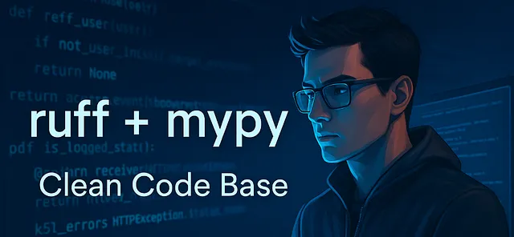
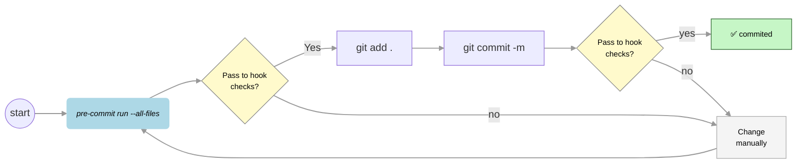

# Template: Python with Ruff and MyPy 



A modern Python project template pre-configured with Ruff (for linting and formatting) and MyPy (for static type checking).
This setup uses pre-commit to ensure code quality before every commit.

You can find concepts and step-by-step instructions in the article in Medium:
* 🔗 [How to: Automate a clean code base with Ruff and Mypy.](https://medium.com/@fernando.peres/how-to-automate-a-clean-code-base-with-ruff-and-mypy-ff7d9fa51e86) 


🚀 Features:
- **Ruff**: Blazing-fast linter and formatter
- **MyPy**: Static type checking for Python
- **pre-commit**: Automated checks before every commit
- **Easy setup**: Fast environment provisioning with `uv`

---

## 1. Installation

Step 1: Install dependencies

```bash
uv sync --all-groups
```

Step 2: Activate the virtual environment

```bash
source .venv/bin/activate
```

Step 3: Set up pre-commit hooks

```bash
pre-commit install  
```

## 2. Usage

Check pre-commit hook status

```bash
pre-commit run --all-files
``` 

Whenever you run:

```bash
git commit -m "<message>"
```
💡 When you run `git commit`, ***pre-commit hooks*** will automatically execute and checks  across the entire codebase by sing mypy and ruff.

#### ⚙️ Pre-commit Hook Behavior and Commit Guidelines: Key Points

* 🔎 Check code compliance:
    Run `pre-commit run --all-files` to validate your code against the defined checks.
	* This command may also attempt to auto-fix some issues.
	* ⛔ If any checks fail, run it again to see if fixes were applied automatically. If not, you must manually fix the remaining issues and re-run the check.
	* Since files may be modified, always execute git add after running pre-commit.
* Staging and committing changes:
    * Stage your files with git add <files>.
	* Commit with git commit -m "...".
	* During commit, `pre-commit run --all-files` is executed automatically.
	* ⛔ If any checks fail, the commit is aborted.
	* 👨🏻‍💻 If issues persist, you’ll need to address them manually before retrying the commit. After fix issues, `pre-commit run --all-files`, re-stage (git add), and commit again.




#### Tips

Commit often:
To avoid losing work or dealing with large diffs, commit small, frequent changes rather than big, uncommitted batches.
* 🟢 Auto-fixable issues:
    Tools like Ruff and Mypy can automatically resolve common issues (e.g., formatting, unused imports, basic typing errors).
* 🟡 Manual fixes required:
    Some issues cannot be auto-fixed and require manual intervention (e.g., ambiguous or logic-specific problems).


## 3. Customization

* Configure Ruff and MyPy via `pyproject.toml`.
* Add or remove `pre-commit` hooks in `.pre-commit-config.yaml`.

Happy coding! 🚀
