# Code Standards

A modern Python project template pre-configured with Ruff (for linting and formatting) and MyPy (for static type checking). This setup uses pre-commit to ensure code quality before every commit.

You can find concepts and step-by-step instructions in the article in Medium:
* 🔗 [How to: Automate a clean code base with Ruff and Mypy.](https://medium.com/@fernando.peres/how-to-automate-a-clean-code-base-with-ruff-and-mypy-ff7d9fa51e86) 

#### ⚙️ Pre-commit Hook Behavior and Commit Guidelines: Key Points

* 🔎 Check code compliance:
    Run `pre-commit run --all-files` to validate your code against the defined checks.
	* This command may also attempt to auto-fix some issues.
	* ⛔ If any checks fail, run it again to see if fixes were applied automatically. If not, you must manually fix the remaining issues and re-run the check.
	* Since files may be modified, always execute git add after running pre-commit.
* Staging and committing changes:
    * Stage your files with git add <files>.
	* Commit with git commit -m "...".
	* During commit, `pre-commit run --all-files` is executed automatically.
	* ⛔ If any checks fail, the commit is aborted.
	* 👨🏻‍💻 If issues persist, you’ll need to address them manually before retrying the commit. After fix issues, `pre-commit run --all-files`, re-stage (git add), and commit again.

```mermaid
flowchart LR
    S((start))
    H(pre-commit run --all-files)
    B{Pass to hook <br>checks?}
    C[✅ commited]
    X[git add .]
    Y[git commit -m ""]
    G[Change<br>manually]
    W{Pass to hook <br>checks?}

    S --> H --> B-- Yes --> X --> Y --> W
    W --yes --> C
    W --no --> G
    B -- no --> G
    G --> H

    classDef decision fill:#fffacc,stroke:#888,font-size:12px,color:#000000;
    classDef success fill:#c6f6c6,stroke:#2c662d,font-size:12px,color:#000000;
    classDef failure fill:#fbd3d3,stroke:#d9534f,font-size:12px,color:#000000;
    classDef standard fill:#f4f4f4,stroke:#aaa,font-size:12px,color:#000000;
    classDef note fill:#ADD8E6,stroke:#ADD8E6,font-size:12px,font-style:italic,color:#000000;

    class A,E,G,H standard
    class B,F,W decision
    class C success
    class D failure
    class H note

    %% Arrow (link) styles
    linkStyle default stroke:#999,stroke-width:1.5px;
```

#### Tips

Commit often:
To avoid losing work or dealing with large diffs, commit small, frequent changes rather than big, uncommitted batches.
* 🟢 Auto-fixable issues:
    Tools like Ruff and Mypy can automatically resolve common issues (e.g., formatting, unused imports, basic typing errors).
* 🟡 Manual fixes required:
    Some issues cannot be auto-fixed and require manual intervention (e.g., ambiguous or logic-specific problems).

## 3. Customization

* Configure Ruff and MyPy via `pyproject.toml`.
* Add or remove `pre-commit` hooks in `.pre-commit-config.yaml`.
